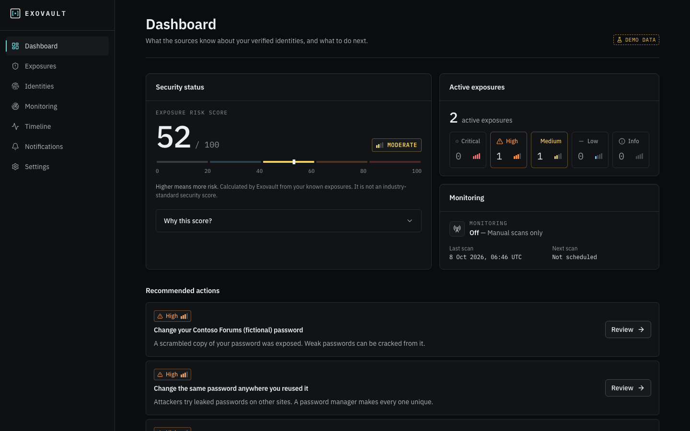
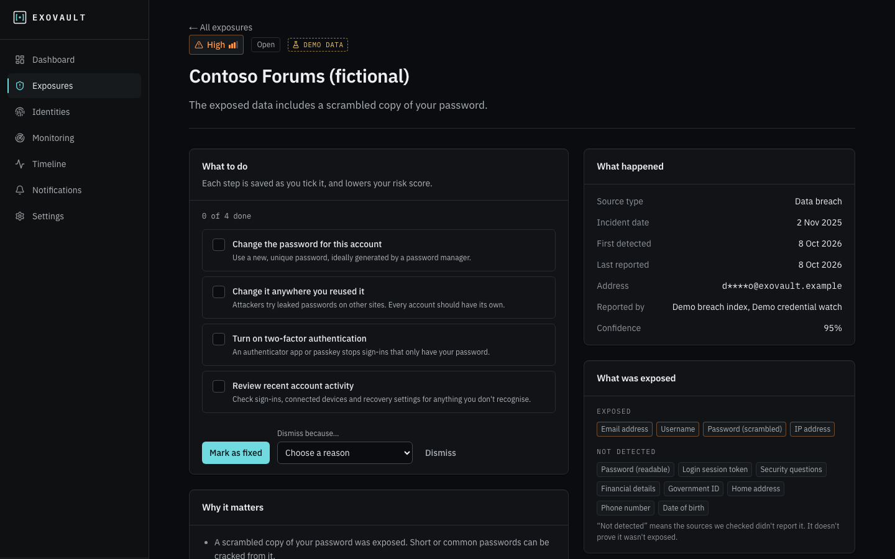
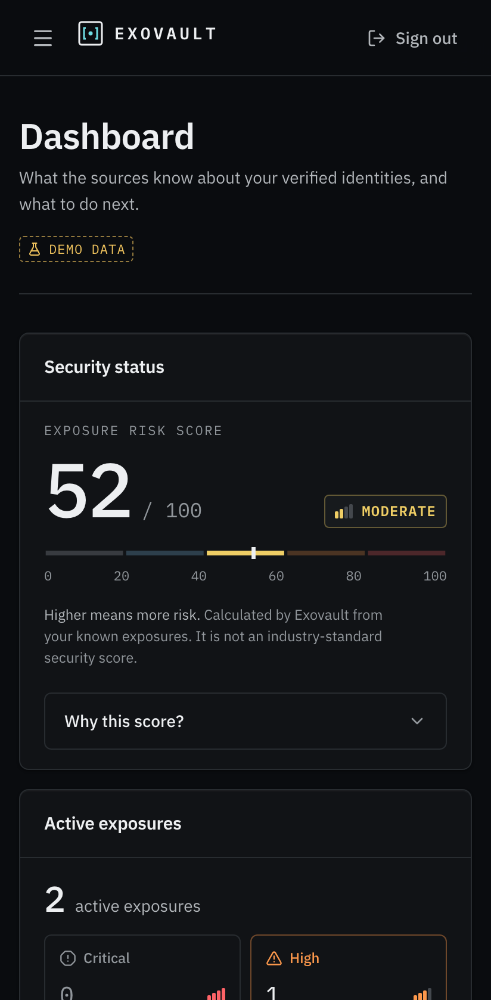
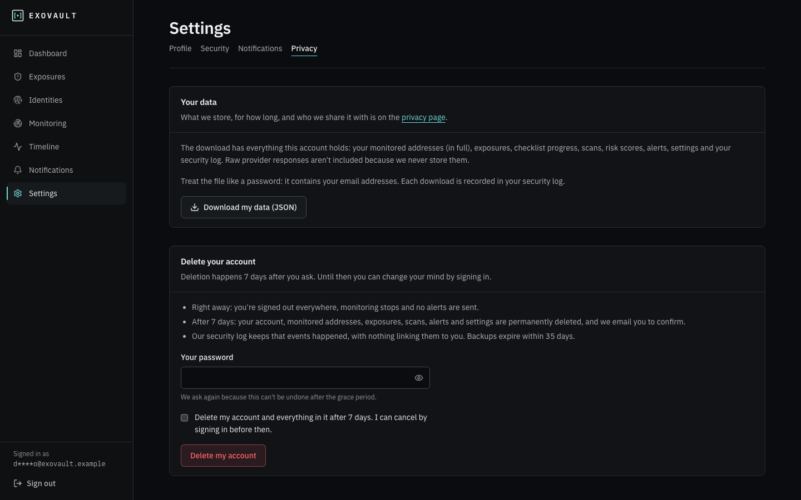
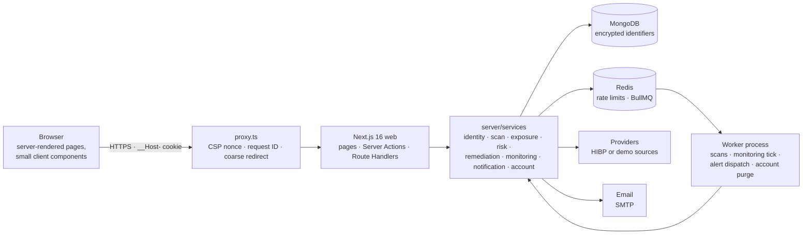

# Exovault

**A privacy-first exposure intelligence platform for individuals.** Exovault checks whether email addresses you've _proved you own_ appear in documented breach and credential-exposure sources, explains what was exposed and how serious it is, and gives you a checklist to fix it. Optionally, it keeps checking and emails you when something changes.

> **Status: M3 complete (Phase 13 of 13).** Everything below exists and is tested. See [`docs/PROGRESS.md`](docs/PROGRESS.md) for what was built in each phase and what remains.



| Exposure detail and checklist                            | Mobile                                                         | Your data: export and deletion                             |
| -------------------------------------------------------- | -------------------------------------------------------------- | ---------------------------------------------------------- |
|  |  |  |

All screenshots show the fictional demo data the app labels "Demo data".

## What it is not

Not a dark-web crawler, not complete coverage, and not a guarantee of safety. Exovault reports only what its configured providers know. "No results" means "not found in the sources we checked", never "you're safe". It only checks addresses whose owners have confirmed them, so it can't be used to look up someone else.

## What it does

- **Verify, then check:**
  - Your account email is verified with a code.
  - Any other address you want checked gets its own ownership code before a single lookup happens.
- **Scan with honest progress:**
  - Sources are asked in parallel with timeouts, retries and a circuit breaker.
  - Progress streams from persisted state (SSE), never invented steps.
  - Partial failures are shown, and the failed source can be retried.
- **Understand the findings:**
  - Exposures are normalised and de-duplicated across sources.
  - Each gets a severity based on what was exposed, with a plain-language reason.
  - An **Exposure Risk Score** (0–100) shows every factor it adds up.
- **Fix them:** a per-exposure checklist; progress lowers the score, and every change is kept as a snapshot.
- **Keep watching:**
  - Scheduled monitoring (every 6, 12 or 24 h) runs in a separate worker.
  - Alerts go out only for new or worsened exposures, immediately or as a daily digest, with quiet hours and one-click unsubscribe.
  - A timeline shows every exposure over time.
- **Own your data:**
  - Download everything as JSON.
  - Delete your account with password re-entry and a 7-day grace period.
  - A resumable purge removes everything and leaves the audit trail unlinked from you.

## Architecture



- **Thin web layer:** pages, actions and route handlers authenticate, check ownership in the query, rate-limit and validate. Then they call a service.
- **The worker** is a separate Node process sharing the same `server/` code. It is never run inside a serverless function.
- **No transactions:** MongoDB runs standalone, so correctness comes from unique indexes, compare-and-set transitions and idempotent upserts.

Details: [Architecture](docs/ARCHITECTURE.md), [Exposure engine](docs/EXPOSURE-ENGINE.md), [Database](docs/DATABASE.md).

## Tech choices, and why

| Choice                                                         | Why                                                                                                                                                                                                       |
| -------------------------------------------------------------- | --------------------------------------------------------------------------------------------------------------------------------------------------------------------------------------------------------- |
| **Next.js 16** (App Router, Server Components, Server Actions) | Server rendering keeps sensitive logic and data off the client. Server Actions get origin checks for free. `proxy.ts` handles only headers and coarse redirects, and every handler re-checks the session. |
| **MongoDB + Mongoose**                                         | Embedding bounded, read-together data (per-provider scan results, data types) fits the domain. `sanitizeFilter` blocks operator injection. Designed for a standalone server: no transactions needed.      |
| **Better Auth** (in-process)                                   | A maintained library with email OTP, hashed tokens, a MongoDB adapter and a path to passkeys and MFA. Called from Server Actions, so there's no `/api/auth` surface (D-018).                              |
| **Redis + BullMQ**                                             | Fail-closed rate limits, shared provider budgets, and durable jobs for scans, schedules and the purge, in a worker that scales out.                                                                       |
| **AES-256-GCM + HMAC blind index**                             | Identifiers are unreadable at rest, but duplicates can still be found. Key rotation is built in.                                                                                                          |
| **Zod, pino, Vitest, Playwright, axe**                         | One validation schema for client and server; logs with central redaction; real-database integration tests; a production-build E2E suite with accessibility checks.                                        |

Every non-obvious decision has a record in [`docs/DECISIONS.md`](docs/DECISIONS.md) (D-001 to D-038).

## Security and privacy model

- **Ownership before lookup:** there is no anonymous search of arbitrary addresses. Every identifier is verified by its owner.
- **Encrypted identifiers:**
  - Stored as AES-256-GCM ciphertext bound to their record, with a keyed hash for duplicate checks and a masked form for display.
  - Decrypted only in memory for a provider call, an audited reveal, or the owner's export.
  - In Compass, the `identities` collection shows ciphertext only.
- **Never stored:** plaintext passwords, raw provider responses, leaked values, IP addresses in clear, or identifiers in URLs, logs or audit rows.
- **Application hardening:**
  - Per-request nonce CSP with no `unsafe-inline`.
  - Strict server-side authorization: someone else's record looks exactly like a missing one.
  - Origin checks and fail-closed rate limits.
  - Account-enumeration-safe auth.
  - An append-only audit log of keyed hashes and IDs.
- **Tested adversarially:** IDOR matrix, operator injection, CSRF, a pre-account-hijacking fix, planted-secret log scans, and a whole-database check that a deleted user leaves no trace.

Details: [Security](docs/SECURITY.md), [Threat model](docs/THREAT-MODEL.md), [Privacy data model](docs/PRIVACY-DATA-MODEL.md). The public `/security` and `/privacy` pages say the same in plain language.

## Run it locally

Prerequisites: Node ≥ 22, [MongoDB Community Server](https://www.mongodb.com/try/download/community) on `127.0.0.1:27017`, and Docker (or native Redis and Mailpit).

```bash
docker compose up -d   # Redis (noeviction) + Mailpit at http://localhost:8025
npm install
npm run setup          # .env.local with fresh secrets (if missing) → MongoDB indexes → demo account
npm run dev            # http://localhost:3000
npm run worker         # second terminal: scheduled monitoring, alerts, account purge
```

`npm run setup` prints the demo account's email and a generated password. Set `SEED_DEMO_PASSWORD` before the first run to choose it yourself.

On macOS without Docker: `brew install redis mailpit`, then `brew services start redis` and run `mailpit`. On Windows, run Redis through Docker or WSL; Redis doesn't officially support native Windows.

Other scripts: `npm run db:reset` (drops the local dev database), `npm run keys:rotate` (re-encrypts identifiers after changing the active key), `npm run env:init` (secrets only).

### Demo mode

`PROVIDER_MODE=mock` is the default. Two deterministic, fictional sources stand in for real providers, so no API key is needed, and every result is labelled **"Demo data"**. The address decides the outcome:

- a local part containing `clean` finds nothing;
- `fail` makes both sources fail;
- `partial` fails one;
- `slow` times one out.

Anything else gets a stable mix. Live mode (`PROVIDER_MODE=live`) uses Have I Been Pwned and needs a paid `HIBP_API_KEY` ([Providers](docs/PROVIDERS.md)).

## Quality checks

```bash
npm run lint && npm run format:check && npm run typecheck
npm run test:unit         # unit + component tests (jsdom, axe)
npm run test:integration  # in-memory MongoDB + local Redis (DB 15), including tests/security
npm run test:e2e          # Playwright vs a production build, desktop + mobile; Mailpit; DB exovault_e2e
```

CI runs all of these plus a production dependency audit, a gitleaks secret scan, and Docker builds of both images. See [Testing](docs/TESTING.md).

## Deploying

The web image (`Dockerfile`) is Next's standalone server. The worker image (`Dockerfile.worker`) holds the worker bundle and production dependencies. You need a managed or authenticated MongoDB, a Redis with `noeviction`, an SMTP relay, and HTTPS. See [Deployment](docs/DEPLOYMENT.md) for the full checklist, backups and the Atlas migration path.

## Limitations

- Coverage is whatever the configured providers know. The public demo uses fictional sources.
- Email addresses only. Phone numbers and usernames are modelled (multi-identity from day one) but not offered. One active identity per user by default.
- No two-factor sign-in yet (the architecture is ready for TOTP and passkeys).
- Session tokens are stored by the auth library in plaintext. Mitigations: authenticated, least-privilege DB access, and 7-day expiry.
- Not deployed publicly. The container images are built in CI; their runtime stages were checked locally (D-038).
- A portfolio project, not legal or security advice.

## Roadmap

Two-factor sign-in (TOTP, passkeys) · a password-exposure checker (hashing in the browser, k-anonymity; designed in spec Part 11) · phone and username identities · more providers behind the same contract · KMS-wrapped encryption keys · an exposure graph view (stable IDs already in place).

## Documentation

[Architecture](docs/ARCHITECTURE.md) · [User flows](docs/USER-FLOWS.md) · [API](docs/API.md) · [Database](docs/DATABASE.md) · [Security](docs/SECURITY.md) · [Threat model](docs/THREAT-MODEL.md) · [Privacy data model](docs/PRIVACY-DATA-MODEL.md) · [Risk score](docs/RISK-SCORE.md) · [Exposure engine](docs/EXPOSURE-ENGINE.md) · [Providers](docs/PROVIDERS.md) · [Design system](docs/DESIGN-SYSTEM.md) · [Testing](docs/TESTING.md) · [Deployment](docs/DEPLOYMENT.md) · [Decisions](docs/DECISIONS.md) · [Progress](docs/PROGRESS.md) · [Build spec](docs/MASTER-PROMPT.md)
